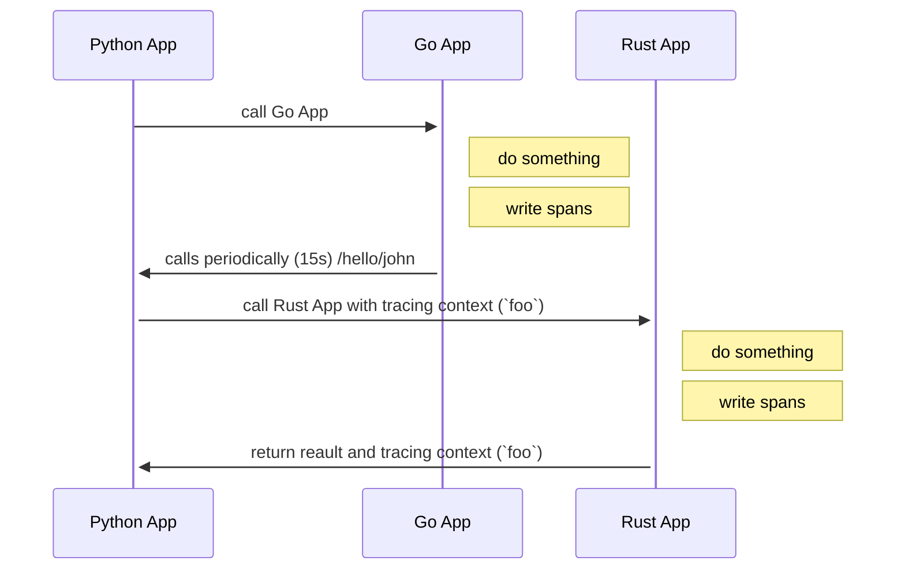

```mermaid
sequenceDiagram

    participant Python App
    participant Go App
    participant Rust App

    Python App ->>+ Go App: call Go App
    Note right of Go App: do something
    Note right of Go App: write spans
    Go App ->>+ Python App: calls periodically (15s) /hello/john
    Python App ->>+ Rust App: call Rust App with tracing context (`foo`)
    Note right of Rust App: do something
    Note right of Rust App: write spans
    Rust App ->>+ Python App: return reault and tracing context (`foo`)
```